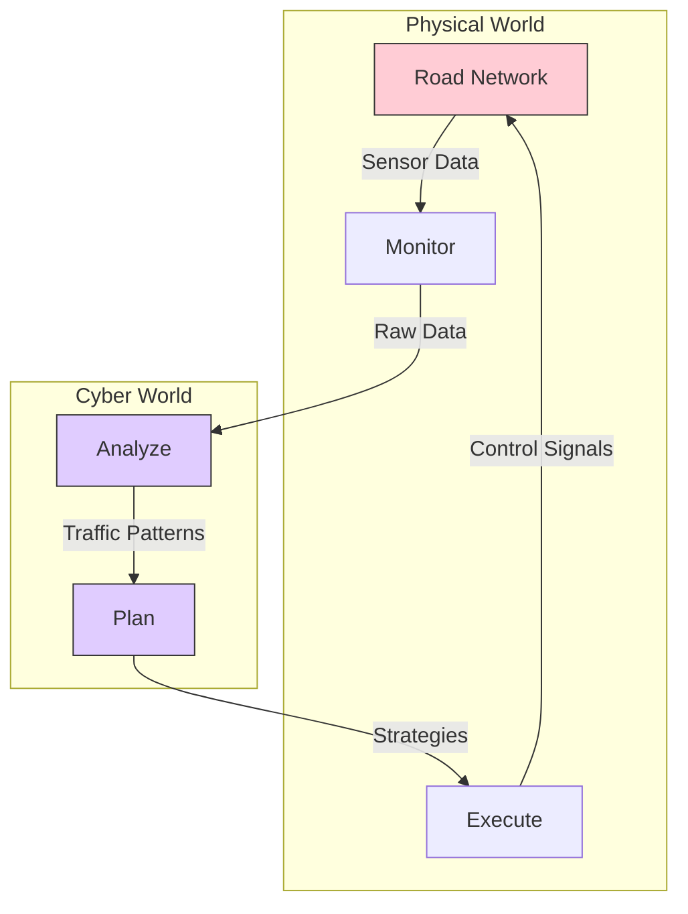
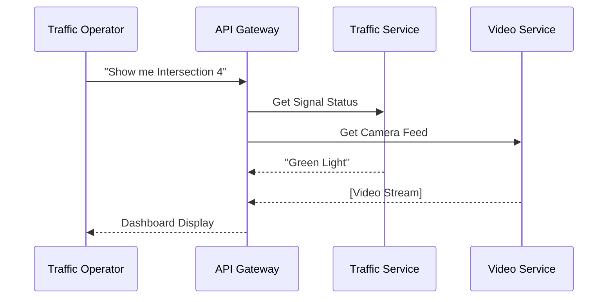

# Module 1: ITS Architecture & Systems Engineering

!!! abstract "Graduate Learning Objectives"
    By the end of this advanced module, you will be able to:
    
    1.  **Deconstruct** complex ITS environments using international frameworks (ARC-IT, FRAME).
    2.  **Evaluate** the trade-offs between Edge Computing and Cloud Computing in transportation contexts.
    3.  **Design** resilient, scalable architectures that adhere to Service-Oriented Architecture (SOA) principles.
    4.  **Analyze** the "Cyber-Physical" nature of modern transportation infrastructure.

---

## 1. The Theoretical Framework: Systems of Systems

Intelligent Transportation Systems (ITS) are not merely a collection of devices; they represent a **System of Systems (SoS)**. Unlike a monolithic system (like a laptop), an SoS is composed of independent systems (traffic lights, GPS satellites, cellular networks) that pool their resources to achieve a new capability.

### 🏛️ The "4-View" Architecture Model (ARC-IT)
Advanced ITS architecture is often viewed through the lens of the **ARC-IT (Architecture Reference for Cooperative and Intelligent Transportation)**, formerly known as the National ITS Architecture in the US.

It defines four critical viewpoints:

| Viewpoint | Question it Answers | Example |
| :--- | :--- | :--- |
| **Enterprise** | *Who* are the stakeholders and what are their relationships? | City Dept. of Transport agrees to share video feeds with Police Dept. |
| **Functional** | *What* processes does the system perform? | "Calculate Travel Time" or "Detect Incident". |
| **Physical** | *Where* is the hardware located? | Roadside Units (RSU), Traffic Management Center (TMC) Servers. |
| **Communications** | *How* does data flow between them? | 5G, Fiber Optic, DSRC. |

!!! tip "Critical Thinking: The Enterprise View"
    Many engineering projects fail not because of technology (Physical View), but because agencies refuse to share data (Enterprise View). As a graduate engineer, you must design for **organizational interoperability** as much as technical interoperability.

---

## 2. Cyber-Physical Systems (CPS) & The Data Loop

ITS is a prime example of a **Cyber-Physical System**. It involves a tight coupling between the computational (cyber) and the physical world.

### The Feedback Loop
The core of any ITS architecture is the **Monitor-Analyze-Plan-Execute (MAPE)** loop.

1.  **Monitor:** Inductive loops detect a queue.
2.  **Analyze:** Algorithms determine "Congestion Level = Severe".
3.  **Plan:** The adaptive engine selects "Flush Strategy".
4.  **Execute:** Traffic lights change to Green.

---

## 3. Edge vs. Cloud Computing in ITS

A major architectural debate in 2024-2030 is **where** the thinking should happen.

### ☁️ Cloud Computing (Centralized)
*   **Concept:** All data is sent to a massive central server farm (AWS, Azure, or City Data Center).
*   **Pros:** Unlimited processing power; historical analysis; city-wide coordination.
*   **Cons:** High latency (data must travel far); high bandwidth costs; single point of failure.

### ⚡ Edge Computing (Decentralized)
*   **Concept:** Processing happens *at the roadside* (e.g., inside the traffic light controller or RSU).
*   **Pros:** Ultra-low latency (critical for V2X safety); works even if the internet goes down.
*   **Cons:** Limited processing power; harder to maintain thousands of distributed computers.

!!! example "Case Study: Intersection Safety"
    *   **Cloud Approach:** Send video to cloud -> AI detects pedestrian -> Cloud sends "Red Light" command. *(Too slow! 2 seconds latency = accident).*
    *   **Edge Approach:** Camera detects pedestrian -> Local controller turns light Red immediately. *(< 50ms latency).*

---

## 4. Service-Oriented Architecture (SOA)

Modern ITS software is built using **SOA** or **Microservices**. Instead of one giant program running the city, we have small, independent "services" that talk to each other.

*   **Service A:** "Get Current Weather"
*   **Service B:** "Get Traffic Speed"
*   **Service C:** "Set Signal Timing"

**Why?** If the "Weather Service" crashes, the traffic lights (Service C) keep working!

---

## 5. Network Topology & Resilience

(Refined for Graduate Level)

We discussed Ring and Star topologies. At a graduate level, we consider **Hybrid Mesh Topologies** with **Software Defined Networking (SDN)**.

### SDN: The Programmable Network
In traditional networks, switches are "dumb." In SDN, a central controller can change the rules of the network in real-time.
*   *Scenario:* A fiber cut breaks the main link.
*   *SDN Response:* Instantly re-route high-priority traffic (Signal Control) via a backup wireless link, while dropping low-priority traffic (CCTV) to save bandwidth.

---

## 6. Scalability: The "Big Data" Challenge

ITS generates **Petabytes** of data. 

### The 3 Vs of ITS Data
1.  **Volume:** Terabytes of video footage per day.
2.  **Velocity:** Sensor data arriving every 100 milliseconds.
3.  **Variety:** Structured (SQL), Semi-structured (JSON logs), and Unstructured (Video/Lidar).

**Architectural Solution:**
*   Use **Kafka** or **MQTT** for high-velocity data ingestion.
*   Use **Data Lakes** (Hadoop/S3) for storing raw video.
*   Use **Time-Series Databases** (InfluxDB) for sensor readings.

---

## 7. Standards: The Foundation of Interoperability

While Module 8 covers specifics, architecturally you must enforce standards at the **Interface** level.

*   **NTCIP 1202:** For Traffic Signals.
*   **NTCIP 1204:** For Variable Message Signs (DMS).
*   **SAE J2735:** For Connected Vehicle Messages.
*   **DATEX II:** For Center-to-Center communication (European standard, widely used globally).

---

## ✅ Advanced Module 1 Checkpoint

??? check "Critical Analysis"
    **Q1: In a safety-critical application like 'Red Light Violation Warning', why is Edge Computing superior to Cloud Computing?**
    
    - [ ] It is cheaper.
    - [x] It minimizes latency to milliseconds, which is required to prevent a crash.
    - [ ] The Cloud cannot store video.
    
    *Explanation: Physics dictates that sending data to a data center 100km away takes time. For safety, physics wins.*

    **Q2: Which ARC-IT viewpoint describes the legal and organizational agreements between agencies?**
    
    - [ ] Physical View
    - [ ] Communications View
    - [x] Enterprise View
    
    **Q3: How does Microservices architecture improve system reliability?**
    
    - [ ] It makes the code smaller.
    - [x] It prevents a failure in one non-critical component (like weather data) from crashing critical components (like signal control).
    - [ ] It uses less electricity.