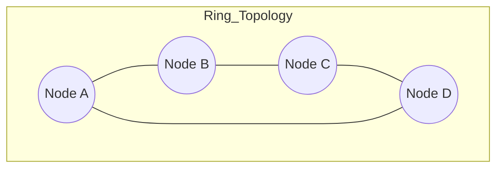

# Module 1: ITS Architecture

!!! abstract "Learning Objectives"
    By the end of this module, you will be able to:
    
    1.  Understand how different ITS components integrate into a unified system.
    2.  Design robust network topologies for transportation infrastructure.
    3.  Explain the importance of redundancy, scalability, and standards.

---

## 1. System Component Integration

Intelligent Transportation Systems are not single devices; they are a **system of systems**. Imagine a human body: the brain (Control Center), the eyes (Cameras/Sensors), and the nerves (Communication Network) must all work together.

### 🧩 The Integration Model

!!! tip "Interactive Concept: The Data Flow"
    Click the diagram below to follow the path of data from the road to the cloud.

```mermaid
graph LR
    subgraph Field_Level [Field Level]
        A[Traffic Sensors] --> B[Roadside Unit (RSU)]
        C[Traffic Signals] --> B
        D[CCTV Cameras] --> B
    end

    subgraph Comm_Level [Communication Level]
        B -->|Fiber/5G| E[Network Switch]
        E -->|Backhaul| F[ISP/WAN]
    end

    subgraph Center_Level [Center Level]
        F --> G[Traffic Management Center]
        G --> H[Data Analytics Server]
        G --> I[Operator Workstation]
    end

    style A fill:#f9f,stroke:#333,stroke-width:2px
    style G fill:#bbf,stroke:#333,stroke-width:2px
```

**Key Takeaway:** Integration is about ensuring that a signal from a *Field Level* device (like a loop detector) can be correctly interpreted by the *Center Level* software.

---

## 2. Interface Design Principles

Good interfaces act as the "translators" between different systems.

??? question "Pop Quiz: Why do we need standard interfaces?"
    **Answer:** Without standard interfaces (like USB for computers), every traffic light manufacturer would need a unique cable and software to connect to the central computer. Standard interfaces allow "Plug and Play" interoperability.

### Core Principles
1.  **Modularity:** You should be able to replace a camera without rewriting the central software.
2.  **Loose Coupling:** A failure in one component shouldn't crash the whole system.
3.  **Standardization:** Using protocols like NTCIP (more on this in Module 8).

---

## 3. Network Topology Design

How do we connect thousands of devices across a city?

### Common Topologies

=== "Star Topology"
    *   **Description:** All devices connect to a central hub.
    *   **Pros:** Easy to manage. If one device fails, others are fine.
    *   **Cons:** If the hub fails, everything goes down.
    *   **Best for:** Small intersections.

=== "Ring Topology"
    *   **Description:** Devices are connected in a closed loop.
    *   **Pros:** **Redundancy!** Data can travel both ways.
    *   **Cons:** More complex configuration.
    *   **Best for:** City-wide fiber backbones.

=== "Mesh Topology"
    *   **Description:** Devices connect to multiple other devices dynamically.
    *   **Pros:** Highly resilient and self-healing.
    *   **Cons:** Latency can be unpredictable.
    *   **Best for:** Wireless sensor networks (V2X).



---

## 4. Redundancy & Reliability

In ITS, "Redundancy" isn't a bad thing—it's a lifesaver.

*   **Network Redundancy:** Having a backup 4G connection if the Fiber line is cut.
*   **Power Redundancy:** UPS (Uninterruptible Power Supply) batteries for traffic signals.
*   **Server Redundancy:** Having a backup control center in a different location.

!!! failure "Scenario: The Power Cut"
    Imagine a storm knocks out power to a major intersection. 
    
    *   **Without Redundancy:** Signals go dark. Accidents happen.
    *   **With Redundancy:** The UPS kicks in immediately. Signals flash red (fail-safe mode) or continue operating for 4 hours, giving police time to arrive.

---

## 5. Scalability & Performance

### Scalability
Can your system handle **100** cameras? What about **10,000**?
*   **Vertical Scaling:** Buying a bigger server (more RAM/CPU).
*   **Horizontal Scaling:** Adding more servers to share the load.

### Performance Requirements
ITS is "Time-Critical".
*   **Latency:** The delay in data transmission. For V2X safety messages, this must be **< 10ms**.
*   **Bandwidth:** The amount of data. CCTV requires **High Bandwidth**, while sensor data requires **Low Bandwidth**.

| Application | Latency Requirement | Bandwidth Requirement |
| :--- | :--- | :--- |
| Traffic Signal Control | Moderate (< 1s) | Low |
| CCTV Monitoring | High (< 2s) | High (Video) |
| **V2X Crash Avoidance** | **Critical (< 0.02s)** | Low |

---

## 6. Standards Compliance

We will cover this deeply in Module 8, but for Architecture, remember:
**Never build a proprietary system.** Always ask: "Does this comply with NTCIP or ISO standards?"

---

## ✅ Module 1 Checkpoint

??? check "Test your understanding"
    **Q1: Which topology provides the best resilience for a city fiber backbone?**
    
    - [ ] Star Topology
    - [x] Ring Topology
    - [ ] Bus Topology
    
    *Explanation: Ring topology allows data to travel in the opposite direction if a line is cut, keeping the network alive.*

    **Q2: Why is low latency critical for V2X?**
    
    - [ ] To stream 4K video
    - [x] To prevent accidents in real-time
    - [ ] To save battery
