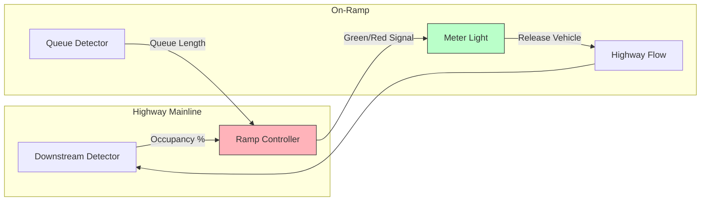
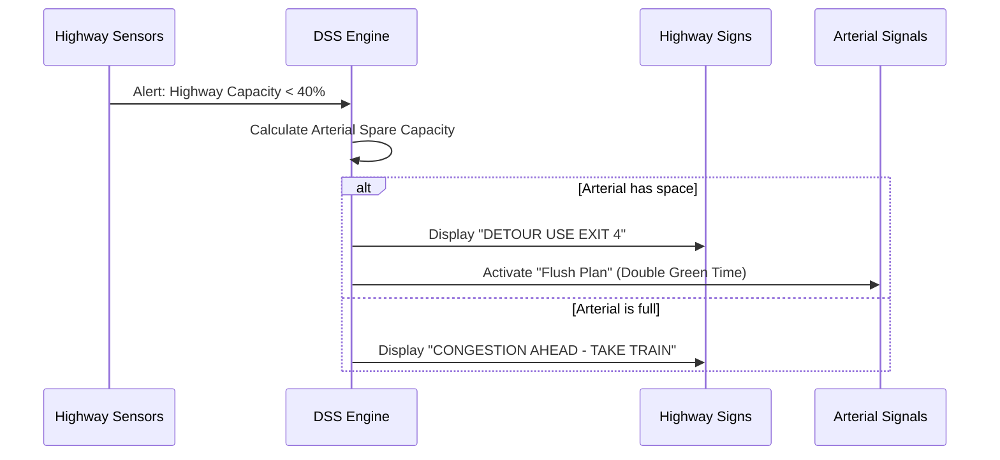

# Module 2: Advanced Traffic Management Systems (ATMS)

!!! abstract "Graduate Learning Objectives"
    By the end of this advanced module, you will be able to:
    
    1.  **Analyze** the architecture of Active Traffic Management (ATM) strategies like Hard Shoulder Running and Variable Speed Limits.
    2.  **Design** Integrated Corridor Management (ICM) strategies to balance demand across highways and arterials.
    3.  **Evaluate** the role of AI and Predictive Analytics in shifting from reactive to proactive traffic operations.
    4.  **Formulate** complex decision trees for Traffic Incident Management (TIM).

---

## 1. From TMS to ATMS: The Paradigm Shift

Traditional Traffic Management Systems (TMS) were **Reactive**: "See a crash, send a tow truck."
Modern **Advanced Traffic Management Systems (ATMS)** are **Proactive**: "Predict congestion, adjust signal timing to prevent it."

### The 4 Layers of ATMS
1.  **Sensing Layer:** LiDAR, Radar, Video Analytics, Floating Car Data (FCD).
2.  **Communication Layer:** Fiber backbones, 5G, SD-WAN.
3.  **Processing Layer:** Cloud-based Traffic Prediction Engines (AI/ML).
4.  **Service Layer:** Dynamic routing, V2I alerts, Adaptive Control.

---

## 2. Active Traffic Management (ATM) Strategies

ATM involves dynamically managing recurrent and non-recurrent congestion based on prevailing traffic conditions.

### A. Variable Speed Limits (VSL) / Speed Harmonization
The goal is **not** to slow people down, but to prevent "Shockwaves."

*   **Theory:** By slightly reducing the speed limit upstream of a bottleneck (e.g., from 100km/h to 80km/h), we delay the arrival of vehicles, preventing the "Stop-and-Go" oscillation.
*   **Result:** Throughput actually *increases* because flow remains laminar rather than turbulent.

### B. Dynamic Ramp Metering
Controlling the rate at which vehicles enter the highway.

*   **Fixed Rate:** 1 car per 10 seconds.
*   **ALINEA Algorithm:** A feedback loop that adjusts metering based on *downstream* occupancy.

### C. Hard Shoulder Running (HSR)
Temporarily opening the emergency lane for traffic during peak hours.
*   **Safety Requirement:** Must have 100% CCTV coverage and VSL to close the lane instantly if a car stalls.

---

## 3. Integrated Corridor Management (ICM)

Congestion doesn't respect jurisdiction boundaries. ICM treats the Highway, the Parallel Arterial Roads, and Transit (Trains/Buses) as **one single network**.

### The Load Balancing Concept
If the Highway is jammed, ATMS should automatically re-route traffic to the arterial road and adjust the arterial traffic lights to handle the extra load.

---

## 4. Incident Management: The Timeline of Safety

Traffic Incident Management (TIM) is a high-pressure discipline. Every minute a lane is blocked increases the risk of a secondary crash by **2.8%**.

### The TIM Timeline Optimization

1.  **T0 (Incident Occurs)**
2.  **T1 (Detection):** Computer Vision detects stopped pixels. *(Goal: < 1 min)*
3.  **T2 (Verification):** Operator confirms via CCTV. *(Goal: < 2 min)*
4.  **T3 (Response):** Dispatching units. *(Goal: Instant)*
5.  **T4 (Arrival):** Police/Tow truck on scene.
6.  **T5 (Clearance):** Road fully reopened.
7.  **T6 (Recovery):** Traffic returns to normal speed.

!!! warning "Secondary Crashes"
    Secondary crashes are often more severe than the primary incident. Protecting the "End of Queue" with warning vehicles or V2X alerts is critical.

---

## 5. Artificial Intelligence in TMC

We are moving from "Expert Systems" (If-Then rules) to "Deep Learning."

### Use Cases for AI
*   **Short-Term Traffic Prediction (STTP):** Using **LSTM (Long Short-Term Memory)** neural networks to predict flow 15-30 minutes into the future.
*   **Video Analytics:** Automatically detecting wrong-way drivers, pedestrians on highways, or debris.
*   **Digital Twins:** Simulating a "Flush Plan" in a virtual city model before applying it to the real city to ensure it won't cause gridlock.

---

## 6. Data Collection & Fusion Methods

To feed the AI, we need high-quality data fusion.

| Data Source | Type | Strengths | Weaknesses |
| :--- | :--- | :--- | :--- |
| **Inductive Loops** | Fixed | High Accuracy (99.9%) | Maintenance intensive; only measures one point. |
| **Bluetooth/Wi-Fi** | Sampled | Measures Travel Time between A and B | Privacy concerns; low sample rate (5-10%). |
| **Floating Car Data (GPS)** | Mobile | Covers entire network (Google/Waze) | Latency; no volume counts (only speed). |
| **Radar/Lidar** | Fixed | Works in Fog/Rain; multi-lane tracking | Expensive. |

---

## ✅ Advanced Module 2 Checkpoint

??? check "Critical Analysis"
    **Q1: How does the ALINEA ramp metering algorithm differ from fixed-time metering?**
    
    - [ ] It releases cars faster.
    - [x] It uses a feedback loop based on downstream occupancy to prevent highway breakdown.
    - [ ] It is manually controlled by an operator.
    
    *Explanation: ALINEA is a feedback control system (Closed Loop), whereas fixed-time is Open Loop.*

    **Q2: In Integrated Corridor Management (ICM), why must arterial signal timing change when traffic is diverted from the highway?**
    
    - [ ] To save electricity.
    - [x] To accommodate the sudden surge of diverted volume, otherwise the detour route will gridlock.
    - [ ] To stop people from speeding.
    
    **Q3: What is the primary purpose of Speed Harmonization (Variable Speed Limits)?**
    
    - [ ] To issue more speeding tickets.
    - [x] To delay the arrival of vehicles at a bottleneck and prevent flow breakdown (shockwaves).
    - [ ] To reduce noise pollution only.