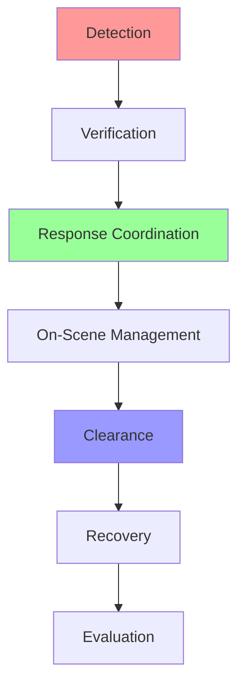

# Module 2: Traffic Management Systems

!!! abstract "Learning Objectives"
    By the end of this module, you will be able to:
    
    1.  Describe the core operations of a Traffic Management Center (TMC).
    2.  Identify tools used for real-time monitoring and incident management.
    3.  Analyze data collection methods for performance evaluation.

---

## 1. Control Centre Operations (TMC)

The **Traffic Management Center (TMC)** is the "brain" of the transportation network. It is where data is collected, processed, and translated into action.

### 🏢 Inside the TMC
A typical TMC combines technology and human expertise:
*   **Video Walls:** Real-time CCTV feeds from major intersections.
*   **Operator Consoles:** Software to control signals, ramp meters, and message signs.
*   **Decision Support Systems:** AI-driven tools that suggest solutions to congestion.

---

## 2. System Monitoring Tools

How do we "see" the traffic?

| Tool | Purpose | Primary Benefit |
| :--- | :--- | :--- |
| **CCTV Cameras** | Visual verification | Identifying the *type* of incident. |
| **Inductive Loops** | Speed & Volume data | Accurate counting of vehicles. |
| **VDS (Vehicle Detection System)** | Flow analysis | Identifying where bottlenecks start. |
| **Waze/Google Data** | Crowdsourced info | Real-time speeds over a wide area. |

---

## 3. Incident Management & Response

An "Incident" is any non-recurring event (crash, stall, spill) that reduces road capacity.

### 🚨 The Incident Life Cycle

1.  **Detection:** Finding out something happened (e.g., a sensor shows speed dropping to 0).
2.  **Verification:** Checking cameras to see if it's a crash or just a slow truck.
3.  **Response:** Sending police, ambulance, or tow trucks.
4.  **Clearance:** Getting the vehicles off the road to restore flow.

---

## 4. Real-time Operations: Response Coordination

When an incident occurs, the TMC uses various methods to communicate with drivers:

=== "DMS (Dynamic Message Signs)"
    *   **Action:** "ACCIDENT AHEAD - USE LEFT LANE"
    *   **Goal:** Warn drivers before they reach the bottleneck.

=== "Signal Timing Adjustments"
    *   **Action:** Change a red light to green for longer on a detour route.
    *   **Goal:** Flush traffic around the incident.

=== "Social Media & Apps"
    *   **Action:** Push notifications to drivers' phones.
    *   **Goal:** Divert traffic before it even enters the highway.

---

## 5. Performance Analysis & Data Collection

We don't just manage traffic; we measure how well we are doing it.

!!! info "Key Performance Indicators (KPIs)"
    *   **Travel Time Index:** The ratio of peak travel time to free-flow travel time.
    *   **Incident Clearance Time:** How fast do we get the road open?
    *   **Throughput:** Number of vehicles passing a point per hour.

### Data Processing Methods
Modern TMS uses **Big Data Analytics** to predict traffic *before* it happens. By analyzing historical patterns, the system can say: *"Every Friday at 5:00 PM, this ramp overflows. Let's adjust the signal timing at 4:45 PM."*

---

## ✅ Module 2 Checkpoint

??? check "Test your knowledge"
    **Q1: What is the primary difference between Incident Detection and Incident Verification?**
    
    - [ ] Detection is done by police; verification is done by sensors.
    - [x] Detection identifies a potential problem; verification confirms it via camera or eyes on the ground.
    - [ ] There is no difference.
    
    **Q2: Which tool is best for counting the exact number of vehicles in a lane?**
    
    - [ ] CCTV
    - [x] Inductive Loops
    - [ ] DMS Signs
