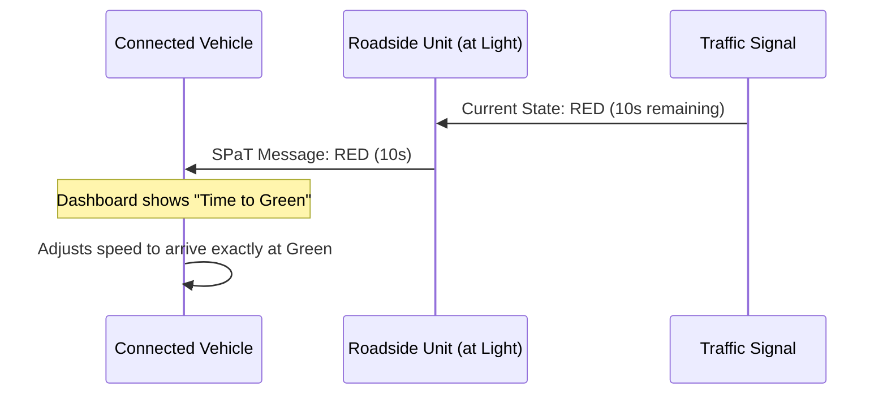

# Module 3: Connected Vehicle Technologies

!!! abstract "Learning Objectives"
    By the end of this module, you will be able to:
    
    1.  Differentiate between V2V, V2I, and V2X communication.
    2.  Understand the implementation of DSRC and C-V2X.
    3.  Explain the security and certification processes for connected vehicles.

---

## 1. V2X Communication Systems

**V2X (Vehicle-to-Everything)** is the umbrella term for a car's ability to "talk" to its surroundings.

*   **V2V (Vehicle-to-Vehicle):** Cars sharing speed and position to avoid collisions.
*   **V2I (Vehicle-to-Infrastructure):** Cars talking to traffic lights (e.g., "The light will turn green in 5 seconds").
*   **V2P (Vehicle-to-Pedestrian):** Alerting a driver that a pedestrian is crossing ahead.
*   **V2N (Vehicle-to-Network):** Connecting to the cloud for traffic updates.

---

## 2. DSRC vs. C-V2X

There are two main "languages" (protocols) vehicles use to talk:

| Feature | **DSRC** (Dedicated Short Range Comm) | **C-V2X** (Cellular V2X) |
| :--- | :--- | :--- |
| **Technology** | Based on Wi-Fi (802.11p) | Based on 4G LTE / 5G |
| **Range** | Short (~300m - 1km) | Long (Miles, via towers) |
| **Latency** | Very Low | Ultra-Low (in 5G) |
| **Status** | Mature, used for years | Rapidly becoming the new standard |

---

## 3. Security & Message Protocols

If a car receives a message saying "Brake Now!", it must be sure the message is **real** and not from a hacker.

### Security Credentials (SCMS)
Connected vehicles use a **Security Credential Management System (SCMS)**. 
*   It issues "digital certificates" to vehicles.
*   Messages are digitally signed to prove they are authentic.
*   Privacy is protected by changing certificates frequently so a car cannot be easily tracked.

### Basic Safety Message (BSM)
The most important message is the **BSM**. It is broadcast **10 times per second** and includes:
1.  Latitude/Longitude
2.  Speed
3.  Heading (Direction)
4.  Brake Status

---

## 4. Testing & Certification Processes

Before a connected vehicle system is deployed, it must pass rigorous tests:

1.  **Bench Testing:** Testing hardware in a lab.
2.  **Field Operational Tests (FOT):** Testing cars on closed tracks or limited public roads.
3.  **Interoperability Testing:** Ensuring a Ford can "talk" to a Toyota and a Siemens traffic signal.
4.  **Certification:** Getting approval from bodies like the FCC (USA) or ETSI (Europe).

---

## 🧩 Interactive Concept: V2I Signal Phase and Timing (SPaT)

---

## ✅ Module 3 Checkpoint

??? check "Test your knowledge"
    **Q1: What does BSM stand for in connected vehicle technology?**
    
    - [ ] Battery Signal Monitor
    - [x] Basic Safety Message
    - [ ] Bluetooth Standard Mode
    
    **Q2: Which technology is based on 5G cellular networks?**
    
    - [ ] DSRC
    - [x] C-V2X
    - [ ] Wi-Fi
