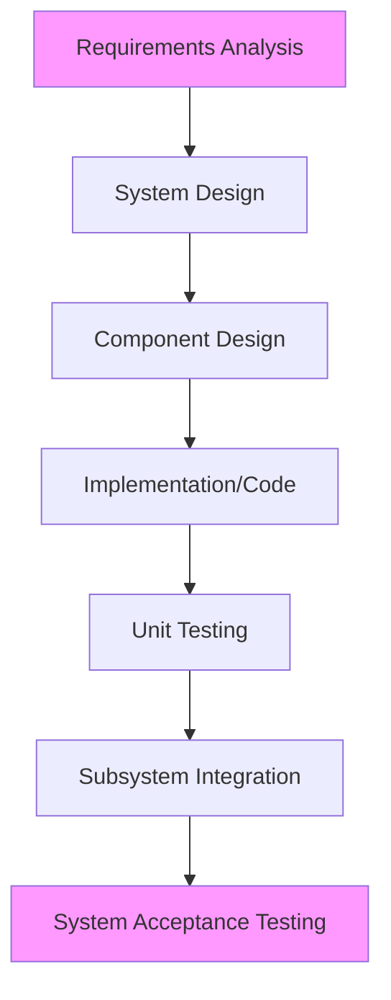

# Module 5: System Integration Methods

!!! abstract "Learning Objectives"
    By the end of this module, you will be able to:
    
    1.  Define interface protocols and subsystem coordination strategies.
    2.  Develop comprehensive testing and documentation standards.
    3.  Plan and execute a successful system integration project.

---

## 1. The Challenge of Integration

Integration is the process of making separate sub-systems (CCTV, Signals, Tolls) work together as one unified "System of Systems."

!!! quote "The Integration Nightmare"
    "We bought the best cameras, the best signals, and the best software. But none of them talk to each other!"

---

## 2. Interface Protocols & Coordination

To solve the nightmare, we use **Interface Control Documents (ICDs)**. An ICD is a contract between two systems defining exactly how they will communicate.

*   **API (Application Programming Interface):** The modern way. System A asks System B for data using a standard web request (REST/JSON).
*   **Legacy Protocols:** Serial connections (RS-232) often found in older traffic cabinets.
*   **Middleware:** Software "glue" that translates between different formats.

---

## 3. Testing Procedures: The V-Model

In ITS, we often use the **V-Model** for integration testing.

1.  **Unit Testing:** Does this specific sensor work on its own?
2.  **Subsystem Integration:** Does the sensor talk to the local controller?
3.  **System Acceptance Testing (SAT):** Does the entire system meet the original requirements?

---

## 4. Documentation & Quality Assurance

If you don't document it, it didn't happen.

*   **As-Built Drawings:** Exact diagrams of where cables were laid (critical for maintenance).
*   **User Manuals:** Instructions for the operators in the TMC.
*   **QA/QC Plans:** Checklists to ensure installation quality (e.g., "Is the cabinet grounded properly?").

---

## 5. Acceptance Criteria

Before paying the contractor, the client must perform **Final Acceptance**.

*   **Functional Test:** "Does the light turn green when I push the button?"
*   **Burn-in Period:** Running the system for 30 days without a single failure. If it fails on Day 29, the clock restarts!

---

## ✅ Module 5 Checkpoint

??? check "Test your knowledge"
    **Q1: What is the purpose of an Interface Control Document (ICD)?**
    
    - [ ] To control the traffic lights.
    - [x] To define exactly how two systems will communicate.
    - [ ] To document the cost of the project.
    
    **Q2: What is a "Burn-in Period"?**
    
    - [ ] Physically burning old equipment.
    - [x] Operating the new system for a set time (e.g., 30 days) to prove reliability.
    - [ ] The time it takes for a server to overheat.
